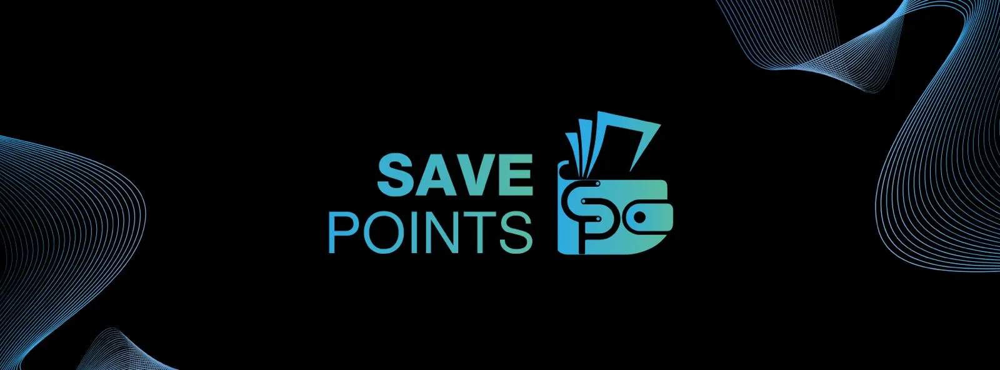

# SavePoints Modern UI 🎨

<div align="center">
  <!--  -->
  
  <h3>📹 Demo</h3>
  
</div>

<div align="center">

[](https://pub.dev/packages/save_points_snackbar_dialog_bottomsheet)
[](https://opensource.org/licenses/MIT)
[](https://flutter.dev)

**[🌐 Live Demo](https://snackbar-dialog-bottomsheet.netlify.app/)** • [📦 Pub.dev](https://pub.dev/packages/save_points_snackbar_dialog_bottomsheet) • [📚 Documentation](https://pub.dev/documentation/save_points_snackbar_dialog_bottomsheet/latest/)


# InfoGraphic


# Real Screenshots


</div>

> A comprehensive Flutter package providing elegant, customizable UI components with stunning glassmorphism effects, smooth animations, and extensive customization options. Perfect for building modern, professional user interfaces.

## 🌟 Overview

**SavePoints Modern UI** is a production-ready Flutter package that offers three powerful, feature-rich UI components:

- **🎭 Dialogs** - Beautiful modal dialogs with glassmorphism design
- **🍞 Snackbars** - Enhanced notifications with rich animations and customization
- **📱 Bottom Sheets** - Modern bottom sheets with drag handles and scroll support

All components feature automatic dark mode support, extensive customization options, and are optimized for performance with built-in repaint boundaries and efficient animations. The codebase follows professional Flutter best practices with comprehensive documentation, well-organized structure, and maintainable code.

## ✨ Key Features

### 🎭 SavePointsDialog

- **✨ Glassmorphism Design** - Beautiful frosted glass effects with backdrop blur
- **🎨 Two design styles** - `solid` (filled) or `outlined` (light bg + colored border); both support light and dark themes
- **🎨 Fully Customizable** - Colors, icons, buttons, and animations
- **⚡ Smooth Animations** - Multiple animation types including fade, slide, scale, bounce, and more
- **🌓 Dark Mode Support** - Automatic theme adaptation
- **📱 Loading States** - Built-in support for async operations with loading indicators
- **🎯 Flexible Actions** - Single or dual button configurations
- **🧩 Custom Content** - Add custom widgets (forms, ratings, etc.) with the optional `child` parameter
- **📳 Haptic Feedback** - Enhanced user experience with tactile responses
- **🔄 Async Support** - Handle asynchronous confirm callbacks with loading states

### 🍞 SavePointsSnackbar

- **📊 Multiple Types** - Success, Error, Warning, and Info variants with predefined styling
- **🎨 Two design styles** - `solid` (filled) or `outlined` (light bg + border, close button); both support light and dark themes
- **🎬 Rich Animations** - 7+ animation types: fade, slide, scale, bounce, rotate, elastic, slideRotate
- **📈 Progress Indicators** - Optional progress bars for timed notifications
- **🎨 Gradient Backgrounds** - Support for custom gradient designs
- **📍 Position Control** - Display at top or bottom of screen with smart margin calculation
- **👆 Interactive** - Tap to dismiss, custom tap handlers, and action buttons
- **🎯 Customizable Styling** - Borders, border radius, margins, colors, and more
- **📳 Haptic Feedback** - Configurable haptic responses
- **⚡ Performance Optimized** - Efficient animations with clamped values

### 📱 SavePointsBottomsheet

- **✨ Modern Design** - Glassmorphism effects with backdrop blur
- **🎨 Two design styles** - `solid` (filled) or `outlined` (light bg + colored border); both support light and dark themes
- **🎚️ Drag Handle** - Optional drag indicator for better UX
- **📜 Scrollable Content** - Built-in support for scrollable content with proper constraints
- **⌨️ Keyboard Aware** - Automatically positions above keyboard when TextFormField is focused
- **⏳ Loading States** - Support for loading indicators during async operations
- **🎬 Custom Animations** - Flexible enter and exit animations
- **📏 Flexible Sizing** - Customizable max height and constraints
- **🌓 Dark Mode Support** - Automatic theme adaptation
- **🎯 Dismissible & Draggable** - Full control over user interactions

## 📦 Installation

Add `save_points_snackbar_dialog_bottomsheet` to your `pubspec.yaml`:

```yaml
dependencies:
  save_points_snackbar_dialog_bottomsheet: ^1.1.9
```

Install the package:

```bash
flutter pub get
```

Import the package:

```dart
import 'package:save_points_snackbar_dialog_bottomsheet/save_points_snackbar_dialog_bottomsheet.dart';
```

## 🚀 Quick Start

### Basic Dialog

```dart
SavePointsDialog.show(
  context,
  title: 'Success',
  message: 'Your changes have been saved successfully!',
  icon: Icons.check_circle,
  iconColor: Colors.green,
  onConfirm: () {
    // Handle confirmation
  },
);
```

### Basic Snackbar

```dart
SavePointsSnackbar.showSuccess(
  context,
  title: 'Success!',
  subtitle: 'Operation completed successfully',
  showProgressIndicator: true,
);
```

### Basic Bottom Sheet

```dart
SavePointsBottomsheet.show(
  context: context,
  title: 'Options',
  icon: Icons.more_vert,
  child: YourContentWidget(),
);
```

### Design styles (solid & outlined)

All components support two visual styles via `ContentDesignStyle`:

- **`solid`** (default) – Filled background, shadow, light text on colored background (snackbar/dialog).
- **`outlined`** – Light/dark surface with colored border and dark/light text; works in both light and dark themes.

```dart
import 'package:save_points_snackbar_dialog_bottomsheet/save_points_snackbar.dart';

// Solid (default)
SavePointsSnackbar.showSuccess(context, title: 'Done!', subtitle: 'Saved.');

// Outlined (light bg + border, close button for snackbar)
SavePointsSnackbar.showSuccess(
  context,
  title: 'Done!',
  subtitle: 'Saved.',
  designStyle: ContentDesignStyle.outlined,
);

// Dialog outlined
SavePointsDialog.show(
  context,
  title: 'Confirm',
  message: 'Proceed?',
  designStyle: ContentDesignStyle.outlined,
  showCancelButton: true,
);

// Bottom sheet outlined
SavePointsBottomsheet.show(
  context: context,
  title: 'Options',
  designStyle: ContentDesignStyle.outlined,
  child: YourContentWidget(),
);
```

Default style can be set in config: `SnackbarConfig.defaultDesignStyle`, `DialogConfig.defaultDesignStyle`.

## 📚 Complete Documentation

### 🎭 SavePointsDialog

#### Method Signature

```dart
static Future<bool?> show(
  BuildContext context, {
  required String title,
  required String message,
  String? confirmText,
  String? cancelText,
  IconData? icon,
  Color? iconColor,
  Color? backgroundColor,
  Color? confirmButtonColor,
  Color? cancelButtonColor,
  bool? showCancelButton,
  VoidCallback? onConfirm,
  Future<bool> Function()? onConfirmAsync,
  VoidCallback? onCancel,
  bool? barrierDismissible,
  DialogAnimationType? animationType,
  DialogAnimationDirection? startAnimation,
  DialogAnimationDirection? endAnimation,
  bool isLoading = false,
  ValueNotifier<bool>? loadingNotifier,
  bool hideLikeCircle = false,
  ContentDesignStyle? designStyle,
  double? blur,
  ImageFilter? backdropFilter,
  Widget? child,
})
```

#### Parameters

| Parameter | Type | Required | Default | Description |
|-----------|------|----------|---------|-------------|
| `title` | `String` | ✅ Yes | - | Dialog title text |
| `message` | `String` | ✅ Yes | - | Dialog message/body text |
| `confirmText` | `String?` | No | `"OK"` | Confirm button text |
| `cancelText` | `String?` | No | `"Cancel"` | Cancel button text |
| `icon` | `IconData?` | No | `null` | Optional icon displayed at the top |
| `iconColor` | `Color?` | No | Theme-based | Icon color |
| `backgroundColor` | `Color?` | No | Theme-based | Dialog background color |
| `confirmButtonColor` | `Color?` | No | Theme-based | Confirm button color |
| `cancelButtonColor` | `Color?` | No | `Colors.grey` | Cancel button color |
| `showCancelButton` | `bool?` | No | `false` | Show cancel button |
| `onConfirm` | `VoidCallback?` | No | `null` | Callback when confirm is pressed |
| `onConfirmAsync` | `Future<bool> Function()?` | No | `null` | Async callback returning bool (true = close dialog) |
| `onCancel` | `VoidCallback?` | No | `null` | Callback when cancel is pressed |
| `barrierDismissible` | `bool?` | No | `true` | Allow dismissing by tapping outside |
| `animationType` | `DialogAnimationType?` | No | `fadeSlide` | Animation type (legacy) |
| `startAnimation` | `DialogAnimationDirection?` | No | `null` | Enter animation direction |
| `endAnimation` | `DialogAnimationDirection?` | No | `null` | Exit animation direction |
| `isLoading` | `bool` | No | `false` | Initial loading state |
| `loadingNotifier` | `ValueNotifier<bool>?` | No | `null` | External loading state control |
| `hideLikeCircle` | `bool` | No | `false` | Disable circular reveal exit animation |
| `designStyle` | `ContentDesignStyle?` | No | `solid` | Design: `solid` (filled) or `outlined` (light bg + border) |
| `blur` | `double?` | No | `20.0` | Backdrop blur sigma (glassmorphism); set ≤0 to disable |
| `backdropFilter` | `ImageFilter?` | No | `null` | Custom backdrop filter (overrides `blur` when set) |
| `child` | `Widget?` | No | `null` | Custom widget displayed between message and buttons |

#### Examples

**1. Info Dialog**

```dart
SavePointsDialog.show(
  context,
  title: 'Information',
  message: 'This is an informational dialog with a custom icon and message.',
  icon: Icons.info,
  iconColor: Colors.blue,
  onConfirm: () {
    ScaffoldMessenger.of(context).showSnackBar(
      const SnackBar(content: Text('Dialog confirmed!')),
    );
  },
);
```

**2. Success Dialog**

```dart
SavePointsDialog.show(
  context,
  title: 'Success!',
  message: 'Your action has been completed successfully.',
  icon: Icons.check_circle,
  iconColor: Colors.green,
  confirmText: 'Great!',
  onConfirm: () {},
);
```

**3. Confirmation Dialog**

```dart
SavePointsDialog.show(
  context,
  title: 'Confirm Action',
  message: 'Are you sure you want to proceed? This action cannot be undone.',
  icon: Icons.warning,
  iconColor: Colors.orange,
  confirmText: 'Yes, Continue',
  cancelText: 'Cancel',
  showCancelButton: true,
  onConfirm: () {
    SavePointsSnackbar.showSuccess(
      context,
      title: 'Confirmed!',
      subtitle: 'Action has been completed',
    );
  },
  onCancel: () {
    SavePointsSnackbar.show(
      context,
      title: 'Cancelled',
      subtitle: 'Action was cancelled',
      type: SnackbarType.info,
    );
  },
);
```

**4. Error Dialog**

```dart
SavePointsDialog.show(
  context,
  title: 'Error',
  message: 'Something went wrong. Please try again later.',
  icon: Icons.error,
  iconColor: Colors.red,
  confirmText: 'OK',
  onConfirm: () {},
);
```

**5. Dialog with Async Loading State**

```dart
final loadingNotifier = ValueNotifier<bool>(false);

SavePointsDialog.show(
  context,
  title: 'Processing',
  message: 'Please wait while we process your request...',
  isLoading: false,
  loadingNotifier: loadingNotifier,
  onConfirmAsync: () async {
    loadingNotifier.value = true;
    await Future.delayed(const Duration(seconds: 3));
    loadingNotifier.value = false;
    return true; // Close dialog on success
  },
);
```

**6. Custom Animation Dialog**

```dart
SavePointsDialog.show(
  context,
  title: 'Animated Dialog',
  message: 'This dialog has custom enter and exit animations!',
  startAnimation: DialogAnimationDirection.fromLeft,
  endAnimation: DialogAnimationDirection.fromRight,
  icon: Icons.celebration,
);
```

**7. Dialog with Custom Backdrop Blur**

```dart
import 'dart:ui';

SavePointsDialog.show(
  context,
  title: 'Glassmorphism',
  message: 'Custom blur intensity for the frosted glass effect.',
  blur: 24.0,
  icon: Icons.blur_on,
);
// Or disable blur: blur: 0
```

**8. Dialog with Custom Child Widget (Form)**

```dart
final nameController = TextEditingController();
final emailController = TextEditingController();

SavePointsDialog.show(
  context,
  title: 'User Information',
  message: 'Please fill in your details below:',
  icon: Icons.person_add,
  iconColor: Colors.deepPurple,
  confirmText: 'Submit',
  cancelText: 'Cancel',
  showCancelButton: true,
  child: Column(
    mainAxisSize: MainAxisSize.min,
    children: [
      TextField(
        controller: nameController,
        decoration: InputDecoration(
          labelText: 'Name',
          hintText: 'Enter your name',
          prefixIcon: const Icon(Icons.person),
          border: OutlineInputBorder(
            borderRadius: BorderRadius.circular(12),
          ),
          filled: true,
        ),
      ),
      const SizedBox(height: 12),
      TextField(
        controller: emailController,
        decoration: InputDecoration(
          labelText: 'Email',
          hintText: 'Enter your email',
          prefixIcon: const Icon(Icons.email),
          border: OutlineInputBorder(
            borderRadius: BorderRadius.circular(12),
          ),
          filled: true,
        ),
        keyboardType: TextInputType.emailAddress,
      ),
    ],
  ),
  onConfirm: () {
    if (nameController.text.isNotEmpty && emailController.text.isNotEmpty) {
      // Process form data
      print('Name: ${nameController.text}, Email: ${emailController.text}');
    }
    nameController.dispose();
    emailController.dispose();
  },
  onCancel: () {
    nameController.dispose();
    emailController.dispose();
  },
);
```

**9. Dialog with Interactive Rating Widget**

```dart
int rating = 0;

SavePointsDialog.show(
  context,
  title: 'Rate Your Experience',
  message: 'How would you rate our service?',
  icon: Icons.star_rounded,
  iconColor: Colors.amber,
  designStyle: ContentDesignStyle.colorHeader,
  confirmText: 'Submit Rating',
  cancelText: 'Skip',
  showCancelButton: true,
  child: StatefulBuilder(
    builder: (context, setState) {
      return Row(
        mainAxisAlignment: MainAxisAlignment.center,
        children: List.generate(5, (index) {
          return IconButton(
            icon: Icon(
              index < rating ? Icons.star : Icons.star_border,
              size: 40,
            ),
            color: Colors.amber,
            onPressed: () {
              setState(() {
                rating = index + 1;
              });
            },
          );
        }),
      );
    },
  ),
  onConfirm: () {
    if (rating > 0) {
      print('User rated: $rating stars');
    }
  },
);
```

### 🍞 SavePointsSnackbar

#### Method Signature

```dart
static ScaffoldFeatureController<SnackBar, SnackBarClosedReason> show(
  BuildContext context, {
  required String title,
  String? subtitle,
  Color? background,
  Gradient? gradient,
  Duration? duration,
  IconData? icon,
  Color? iconColor,
  VoidCallback? onActionPressed,
  String? actionLabel,
  SnackbarType? type,
  SnackbarPosition? position,
  SnackbarAnimation? animation,
  SnackbarAnimationDirection? startAnimation,
  SnackbarAnimationDirection? endAnimation,
  bool? showProgressIndicator,
  bool? dismissible,
  bool? enableHapticFeedback,
  bool? dismissOnTap,
  double? maxWidth,
  EdgeInsets? margin,
  BorderRadius? borderRadius,
  Color? borderColor,
  double? borderWidth,
  VoidCallback? onDismissed,
  VoidCallback? onTap,
  ContentDesignStyle? designStyle,
  double? blur,
  ImageFilter? backdropFilter,
})
```

#### Quick Methods

- `showSuccess(context, {...})` - Success variant with green styling
- `showError(context, {...})` - Error variant with red styling
- `showWarning(context, {...})` - Warning variant with orange styling

#### Parameters

| Parameter | Type | Required | Default | Description |
|-----------|------|----------|---------|-------------|
| `title` | `String` | ✅ Yes | - | Snackbar title text |
| `subtitle` | `String?` | No | `null` | Optional subtitle text |
| `type` | `SnackbarType?` | No | `info` | Type: `info`, `success`, `error`, `warning` |
| `position` | `SnackbarPosition?` | No | `top` | Position: `top` or `bottom` |
| `animation` | `SnackbarAnimation?` | No | `fadeSlide` | Animation type (legacy) |
| `startAnimation` | `SnackbarAnimationDirection?` | No | `null` | Enter animation direction |
| `endAnimation` | `SnackbarAnimationDirection?` | No | `null` | Exit animation direction |
| `duration` | `Duration?` | No | `4 seconds` | Display duration |
| `showProgressIndicator` | `bool?` | No | `false` | Show progress bar |
| `gradient` | `Gradient?` | No | `null` | Custom gradient background |
| `borderColor` | `Color?` | No | `null` | Border color |
| `borderWidth` | `double?` | No | `0` | Border width |
| `dismissOnTap` | `bool?` | No | `false` | Dismiss when tapped |
| `onTap` | `VoidCallback?` | No | `null` | Custom tap handler |
| `onDismissed` | `VoidCallback?` | No | `null` | Callback when dismissed |
| `designStyle` | `ContentDesignStyle?` | No | `solid` | Design: `solid` (filled) or `outlined` (light bg + border) |
| `blur` | `double?` | No | `null` | Backdrop blur sigma (glassmorphism); no blur when null |
| `backdropFilter` | `ImageFilter?` | No | `null` | Custom backdrop filter (overrides `blur` when set) |

#### Examples

**1. Basic Snackbar**

```dart
SavePointsSnackbar.show(
  context,
  title: 'Basic Snackbar',
  subtitle: 'Simple notification example',
  type: SnackbarType.info,
);
```

**2. Success Snackbar**

```dart
SavePointsSnackbar.showSuccess(
  context,
  title: 'Success!',
  subtitle: 'Operation completed successfully',
  showProgressIndicator: true,
);
```

**3. Error Snackbar**

```dart
SavePointsSnackbar.showError(
  context,
  title: 'Error',
  subtitle: 'Failed to complete operation',
  showProgressIndicator: true,
);
```

**4. Warning Snackbar**

```dart
SavePointsSnackbar.showWarning(
  context,
  title: 'Warning',
  subtitle: 'Low balance remaining',
  showProgressIndicator: true,
);
```

**5. Top Position Snackbar**

```dart
SavePointsSnackbar.show(
  context,
  title: 'Top Snackbar',
  subtitle: 'Displayed at the top of the screen',
  position: SnackbarPosition.top,
  showProgressIndicator: true,
  startAnimation: SnackbarAnimationDirection.fromTop,
);
```

**6. Gradient Snackbar with Progress**

```dart
SavePointsSnackbar.show(
  context,
  title: 'Gradient Snackbar',
  subtitle: 'Beautiful gradient background',
  gradient: const LinearGradient(
    colors: [Color(0xFF667eea), Color(0xFF764ba2)],
  ),
  showProgressIndicator: true,
);
```

**7. Bounce Animation Snackbar**

```dart
SavePointsSnackbar.show(
  context,
  title: 'Bounce Animation',
  subtitle: 'Custom bounce effect',
  animation: SnackbarAnimation.bounce,
  type: SnackbarType.success,
);
```

**8. Slide Rotate Animation Snackbar**

```dart
SavePointsSnackbar.show(
  context,
  title: 'Slide Rotate',
  subtitle: 'Combined animation effect',
  animation: SnackbarAnimation.slideRotate,
  type: SnackbarType.info,
  showProgressIndicator: true,
);
```

**9. Tap to Dismiss Snackbar**

```dart
SavePointsSnackbar.show(
  context,
  title: 'Tap to Dismiss',
  subtitle: 'Touch anywhere to close',
  dismissOnTap: true,
  type: SnackbarType.info,
);
```

**10. Bordered Snackbar**

```dart
SavePointsSnackbar.show(
  context,
  title: 'Bordered Snackbar',
  subtitle: 'With custom border styling',
  borderColor: Colors.orange,
  borderWidth: 2,
  borderRadius: BorderRadius.circular(12),
  type: SnackbarType.warning,
);
```

**11. Elastic Animation Snackbar**

```dart
SavePointsSnackbar.show(
  context,
  title: 'Elastic Animation',
  subtitle: 'Smooth elastic effect',
  animation: SnackbarAnimation.elastic,
  type: SnackbarType.success,
);
```

**12. Custom Direction Animation Snackbar**

```dart
SavePointsSnackbar.show(
  context,
  title: 'Custom Animation',
  subtitle: 'Slides in from left',
  startAnimation: SnackbarAnimationDirection.fromLeft,
  endAnimation: SnackbarAnimationDirection.fromRight,
  type: SnackbarType.info,
  showProgressIndicator: true,
);
```

**13. Snackbar with Backdrop Blur**

```dart
import 'dart:ui';

SavePointsSnackbar.show(
  context,
  title: 'Glassmorphism Snackbar',
  subtitle: 'Frosted glass effect behind the snackbar',
  blur: 12.0,
  type: SnackbarType.info,
);
```

### 📱 SavePointsBottomsheet

#### Method Signature

```dart
static Future<T?> show<T>({
  required BuildContext context,
  String? title,
  Widget? child,
  IconData? icon,
  Color? iconColor,
  Color? backgroundColor,
  bool? isDismissible,
  bool? enableDrag,
  bool? showHandle,
  double? maxHeight,
  bool isScrollControlled = false,
  BottomsheetAnimationDirection? startAnimation,
  BottomsheetAnimationDirection? endAnimation,
  bool isLoading = false,
  ValueNotifier<bool>? loadingNotifier,
  bool hideLikeCircle = false,
  ContentDesignStyle? designStyle,
  double? blur,
  ImageFilter? backdropFilter,
})
```

#### Parameters

| Parameter | Type | Required | Default | Description |
|-----------|------|----------|---------|-------------|
| `title` | `String?` | No | `null` | Bottom sheet title |
| `child` | `Widget?` | No | `null` | Content widget |
| `icon` | `IconData?` | No | `null` | Optional icon next to title |
| `iconColor` | `Color?` | No | Theme-based | Icon color |
| `backgroundColor` | `Color?` | No | Theme-based | Background color |
| `isDismissible` | `bool?` | No | `true` | Allow dismissing by tapping outside |
| `enableDrag` | `bool?` | No | `true` | Enable drag to dismiss |
| `showHandle` | `bool?` | No | `true` | Show drag handle indicator |
| `maxHeight` | `double?` | No | `90% of screen` | Maximum height |
| `isScrollControlled` | `bool` | No | `false` | Enable scroll control |
| `startAnimation` | `BottomsheetAnimationDirection?` | No | `null` | Enter animation |
| `endAnimation` | `BottomsheetAnimationDirection?` | No | `null` | Exit animation |
| `isLoading` | `bool` | No | `false` | Initial loading state |
| `loadingNotifier` | `ValueNotifier<bool>?` | No | `null` | External loading control |
| `hideLikeCircle` | `bool` | No | `false` | Disable circular reveal exit animation |
| `designStyle` | `ContentDesignStyle?` | No | `solid` | Design: `solid` (filled) or `outlined` (light bg + border) |
| `blur` | `double?` | No | `20.0` | Backdrop blur sigma (glassmorphism); set ≤0 to disable |
| `backdropFilter` | `ImageFilter?` | No | `null` | Custom backdrop filter (overrides `blur` when set) |

#### Examples

**1. Basic Bottom Sheet**

```dart
SavePointsBottomsheet.show(
  context: context,
  title: 'Bottom Sheet',
  child: const Padding(
    padding: EdgeInsets.all(24.0),
    child: Text(
      'This is a modern bottom sheet with glassmorphism design. '
      'It features beautiful backdrop blur effects and smooth animations.',
      style: TextStyle(fontSize: 16),
    ),
  ),
);
```

**2. Options Menu Bottom Sheet**

```dart
SavePointsBottomsheet.show(
  context: context,
  title: 'Options',
  icon: Icons.more_vert,
  child: Column(
    mainAxisSize: MainAxisSize.min,
    children: [
      ListTile(
        leading: const Icon(Icons.edit),
        title: const Text('Edit'),
        subtitle: const Text('Modify this item'),
        onTap: () => Navigator.pop(context),
      ),
      const Divider(),
      ListTile(
        leading: const Icon(Icons.share),
        title: const Text('Share'),
        subtitle: const Text('Share with others'),
        onTap: () => Navigator.pop(context),
      ),
      const Divider(),
      ListTile(
        leading: const Icon(Icons.delete, color: Colors.red),
        title: const Text('Delete', style: TextStyle(color: Colors.red)),
        subtitle: const Text('Remove this item permanently'),
        onTap: () => Navigator.pop(context),
      ),
    ],
  ),
);
```

**3. Animated Bottom Sheet**

```dart
SavePointsBottomsheet.show(
  context: context,
  title: 'Animated Bottom Sheet',
  startAnimation: BottomsheetAnimationDirection.fromLeft,
  endAnimation: BottomsheetAnimationDirection.fromRight,
  child: const Padding(
    padding: EdgeInsets.all(24.0),
    child: Text(
      'This bottom sheet slides in from the left and exits to the right.',
      style: TextStyle(fontSize: 16),
    ),
  ),
);
```

**4. Bottom Sheet with Loading State**

```dart
final loadingNotifier = ValueNotifier<bool>(false);

SavePointsBottomsheet.show(
  context: context,
  title: 'Loading Data',
  isLoading: false,
  loadingNotifier: loadingNotifier,
  child: const SizedBox(),
);

// Simulate loading
Future.delayed(const Duration(milliseconds: 500), () {
  loadingNotifier.value = true;
  Future.delayed(const Duration(seconds: 2), () {
    loadingNotifier.value = false;
    if (context.mounted) {
      Navigator.pop(context);
      SavePointsSnackbar.showSuccess(
        context,
        title: 'Loaded!',
        subtitle: 'Data loaded successfully',
      );
    }
  });
});
```

**5. Scrollable Bottom Sheet**

```dart
SavePointsBottomsheet.show(
  context: context,
  title: 'Scrollable Content',
  icon: Icons.swap_vert,
  isScrollControlled: true,
  child: Column(
    mainAxisSize: MainAxisSize.min,
    children: List.generate(
      15,
      (index) => ListTile(
        leading: CircleAvatar(
          child: Text('${index + 1}'),
        ),
        title: Text('Item ${index + 1}'),
        subtitle: Text('This is item number ${index + 1}'),
        onTap: () => Navigator.pop(context),
      ),
    ),
  ),
);
```

**6. Settings Bottom Sheet**

```dart
SavePointsBottomsheet.show(
  context: context,
  title: 'Settings',
  icon: Icons.settings,
  child: Column(
    mainAxisSize: MainAxisSize.min,
    children: [
      SwitchListTile(
        title: const Text('Enable Notifications'),
        subtitle: const Text('Receive push notifications'),
        value: true,
        onChanged: (_) {},
      ),
      const Divider(),
      SwitchListTile(
        title: const Text('Dark Mode'),
        subtitle: const Text('Use dark theme'),
        value: false,
        onChanged: (_) {},
      ),
      const Divider(),
      ListTile(
        leading: const Icon(Icons.language),
        title: const Text('Language'),
        subtitle: const Text('English'),
        trailing: const Icon(Icons.chevron_right),
        onTap: () => Navigator.pop(context),
      ),
    ],
  ),
);
```

**7. Bottom Sheet with Custom Blur**

```dart
import 'dart:ui';

SavePointsBottomsheet.show(
  context: context,
  title: 'Glassmorphism',
  icon: Icons.blur_on,
  blur: 16.0,
  child: const Padding(
    padding: EdgeInsets.all(24.0),
    child: Text(
      'Backdrop blur can be customized with the blur parameter.',
      style: TextStyle(fontSize: 16),
    ),
  ),
);
```

## 🎭 Dialog Presets

Use predefined configurations for common dialog flows:

```dart
import 'package:save_points_snackbar_dialog_bottomsheet/presets/presets.dart';
```

**Delete confirmation**

```dart
final confirmed = await DialogPresets.showDeleteConfirmation(
  context,
  itemName: 'My Document',
);
if (confirmed == true) {
  // Delete the item
}
```

**Logout confirmation**

```dart
final confirmed = await DialogPresets.showLogoutConfirmation(context);
if (confirmed == true) {
  // Perform logout
}
```

**Discard changes**

```dart
final confirmed = await DialogPresets.showDiscardChangesConfirmation(context);
if (confirmed == true) {
  Navigator.pop(context);
}
```

**Update available**

```dart
DialogPresets.showUpdateAvailable(context);
```

**Feature not available**

```dart
DialogPresets.showFeatureNotAvailable(context);
```

## 🎨 Animation Types

### Dialog Animations

**DialogAnimationType** (Legacy):
- `fadeSlide` - Fade with slide (default)
- `scale` - Scale animation
- `slideBottom` - Slide from bottom
- `slideTop` - Slide from top
- `slideLeft` - Slide from left
- `slideRight` - Slide from right
- `bounce` - Bounce animation
- `rotateScale` - Rotate with scale
- `elastic` - Elastic animation
- `none` - No animation

**DialogAnimationDirection** (New):
- `fromTop`, `fromBottom`, `fromLeft`, `fromRight` - Slide directions
- `fade` - Fade in/out
- `scale` - Scale animation
- `rotateScale` - Rotate with scale
- `bounce` - Bounce animation
- `elastic` - Elastic animation
- `none` - No animation

### Snackbar Animations

**SnackbarAnimation** (Legacy):
- `fadeSlide` - Fade with slide (default)
- `scale` - Scale animation
- `slide` - Slide animation
- `bounce` - Bounce animation
- `rotate` - Rotate animation
- `elastic` - Elastic animation
- `slideRotate` - Slide with rotate
- `none` - No animation

**SnackbarAnimationDirection** (New):
- `fromTop`, `fromBottom`, `fromLeft`, `fromRight` - Slide directions
- `fade` - Fade in/out
- `scale` - Scale animation
- `rotateScale` - Rotate with scale
- `bounce` - Bounce animation
- `elastic` - Elastic animation
- `none` - No animation

### Bottom Sheet Animations

**BottomsheetAnimationDirection**:
- `fromBottom` - Slide from bottom (default)
- `fromLeft` - Slide from left
- `fromRight` - Slide from right
- `fade` - Fade in/out
- `scale` - Scale animation
- `none` - No animation

## ⚙️ Configuration

SavePoints Modern UI provides a centralized configuration system through `SavePointsConfig`:

```dart
// Configure global defaults
final config = SavePointsConfig();
config.snackbar
  ..defaultDuration = Duration(seconds: 5)
  ..defaultType = SnackbarType.info
  ..defaultShowProgressIndicator = true
  ..defaultDesignStyle = ContentDesignStyle.outlined; // or .solid

config.dialog
  ..defaultConfirmText = 'Continue'
  ..defaultShowCancelButton = true
  ..defaultDesignStyle = ContentDesignStyle.outlined; // or .solid
```

See the [Configuration Guide](https://github.com/yourusername/save_points_snackbar_dialog_bottomsheet/wiki/Configuration) for more details.

## 📱 Platform Support

| Platform | Status |
|----------|--------|
| iOS | ✅ Fully Supported |
| Android | ✅ Fully Supported |
| Web | ✅ Fully Supported |
| macOS | ✅ Fully Supported |
| Linux | ✅ Fully Supported |
| Windows | ✅ Fully Supported |

## 🎯 Performance

- **Repaint Boundaries** - Strategic use of `RepaintBoundary` widgets to minimize repaints
- **Cached Configurations** - Color configs and MediaQuery values are cached
- **Optimized Animations** - Clamped animations prevent overflow errors
- **Efficient Builds** - Widgets extracted to prevent unnecessary rebuilds
- **Code Quality** - Professional code structure with constants extraction and optimized helper methods

## 🔧 Running the Example

The example app is located in the `lib/main.dart` file and demonstrates all features of the package.

1. Clone the repository:
   ```bash
   git clone https://github.com/yourusername/save_points_snackbar_dialog_bottomsheet.git
   cd save_points_snackbar_dialog_bottomsheet
   ```

2. Install dependencies:
   ```bash
   flutter pub get
   ```

3. Run the example:
   ```bash
   flutter run
   ```

The example app includes:
- **Animated UI** - Beautiful gradient backgrounds, staggered animations, and smooth transitions
- **Interactive Buttons** - Scale, hover, and ripple effects on all action buttons
- **Bottom Navigation** - Navigate between sections with snackbar feedback
- **Comprehensive Examples** - Over 40+ examples showcasing all features
- **Dialog Presets** - Examples using predefined dialog configurations
- **Advanced Flows** - Multi-step interactions and combined component usage
- **Professional Code** - Well-organized, documented, and maintainable codebase following Flutter best practices

## 📖 Additional Resources

- [🌐 Live Demo](https://eclectic-dasik-b48e1b.netlify.app/) - Try the components in your browser
- [Full API Documentation](https://pub.dev/documentation/save_points_snackbar_dialog_bottomsheet/latest/)
- [Example App](https://github.com/yourusername/save_points_snackbar_dialog_bottomsheet/tree/main/example)
- [Issue Tracker](https://github.com/yourusername/save_points_snackbar_dialog_bottomsheet/issues)

## 🤝 Contributing

Contributions are welcome and greatly appreciated! Before submitting a pull request, please ensure:

1. ✅ Code follows the existing style and conventions
2. ✅ All tests pass (`flutter test`)
3. ✅ Documentation is updated
4. ✅ No breaking changes (or properly documented)

### Development Setup

1. Fork the repository
2. Create your feature branch (`git checkout -b feature/amazing-feature`)
3. Commit your changes (`git commit -m 'Add some amazing feature'`)
4. Push to the branch (`git push origin feature/amazing-feature`)
5. Open a Pull Request

## 📄 License

This project is licensed under the MIT License - see the [LICENSE](LICENSE) file for details.

## 🙏 Acknowledgments

- Built with [Flutter](https://flutter.dev/)
- Inspired by modern UI/UX design principles
- Glassmorphism effects using Flutter's `BackdropFilter`
- Performance optimizations based on Flutter best practices

## 💬 Support

- **Issues**: [GitHub Issues](https://github.com/yourusername/save_points_snackbar_dialog_bottomsheet/issues)
- **Discussions**: [GitHub Discussions](https://github.com/yourusername/save_points_snackbar_dialog_bottomsheet/discussions)
- **Email**: support@savepoints.dev

---

<div align="center">

**Made with ❤️ by the SavePoints team**

[⭐ Star us on GitHub](https://github.com/yourusername/save_points_snackbar_dialog_bottomsheet) • [🌐 Live Demo](https://eclectic-dasik-b48e1b.netlify.app/) • [📦 Pub.dev](https://pub.dev/packages/save_points_snackbar_dialog_bottomsheet) • [📚 Documentation](https://pub.dev/documentation/save_points_snackbar_dialog_bottomsheet/latest/)

</div>
